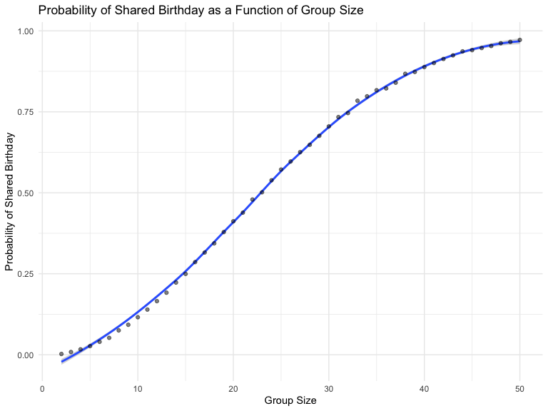
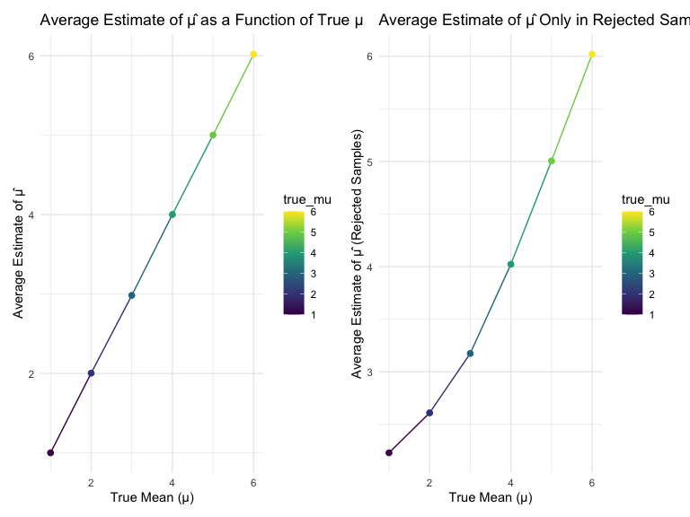

p8105_hw5_rd3096
================
Timothy Du

# load necessary pakages

``` r
library(tidyverse)
```

    ## ── Attaching core tidyverse packages ──────────────────────── tidyverse 2.0.0 ──
    ## ✔ dplyr     1.1.4     ✔ readr     2.1.5
    ## ✔ forcats   1.0.0     ✔ stringr   1.5.1
    ## ✔ ggplot2   3.5.1     ✔ tibble    3.2.1
    ## ✔ lubridate 1.9.3     ✔ tidyr     1.3.1
    ## ✔ purrr     1.0.2     
    ## ── Conflicts ────────────────────────────────────────── tidyverse_conflicts() ──
    ## ✖ dplyr::filter() masks stats::filter()
    ## ✖ dplyr::lag()    masks stats::lag()
    ## ℹ Use the conflicted package (<http://conflicted.r-lib.org/>) to force all conflicts to become errors

``` r
library(rvest)
```

    ## 
    ## Attaching package: 'rvest'
    ## 
    ## The following object is masked from 'package:readr':
    ## 
    ##     guess_encoding

``` r
library(ggplot2)
library(purrr)

set.seed(1)


knitr::opts_chunk$set(
    echo = TRUE,
    warning = FALSE,
    fig.width = 8, 
  fig.height = 6,
  out.width = "90%"
)

theme_set(theme_minimal() + theme(legend.position = "bottom"))

options(
  ggplot2.continuous.colour = "viridis",
  ggplot2.continuous.fill = "viridis"
)

scale_colour_discrete = scale_colour_viridis_d
scale_fill_discrete = scale_fill_viridis_d
```

## problem 1

we define a function to simulate birthdays and check for duplicates

``` r
simulate_shared_birthday = function(n) {
  
  birthdays = sample(1:365, n, replace = TRUE)
  
  has_duplicate = any(duplicated(birthdays))
}
```

we run this 10000 timese based on a sample size of 2-50

``` r
compute_duplicate_probability = function(n) {
  
  simulations = map(1:10000, ~simulate_shared_birthday(n)) %>% 
    unlist()
  
  prob = mean(simulations)
  
  # Return result as a tibble
  tibble(
    group_size = n,
    prob_duplicate = prob
  )
}

result_final = map_dfr(2:50, compute_duplicate_probability)

result_final
```

    ## # A tibble: 49 × 2
    ##    group_size prob_duplicate
    ##         <int>          <dbl>
    ##  1          2         0.0024
    ##  2          3         0.0085
    ##  3          4         0.0167
    ##  4          5         0.0267
    ##  5          6         0.0399
    ##  6          7         0.0521
    ##  7          8         0.0751
    ##  8          9         0.0925
    ##  9         10         0.116 
    ## 10         11         0.139 
    ## # ℹ 39 more rows

Make a plot showing the relationship between probability and group size

``` r
ggplot(
  result_final, 
  aes(x = group_size, y = prob_duplicate)
  ) +
  geom_smooth() +
  geom_point(alpha=0.5) +
  labs(
    title = "Probability of Shared Birthday as a Function of Group Size",
    x = "Group Size",
    y = "Probability of Shared Birthday"
  ) +
  theme_minimal()
```

    ## `geom_smooth()` using method = 'loess' and formula = 'y ~ x'



## problem 2

create one-sample t test function and power function

``` r
simulation_test = function(mu, n=30,sigma=5) {
  
  x = rnorm(mean=mu,n=30, sd = sigma)

  one_sample_ttest = t.test (x,mu = 0)
  simulation_test
  broom::tidy(one_sample_ttest)
}

calculate_power = function(mu, n = 30, sigma = 5) {
 
  simulation_test_results = map_dfr(1:5000, ~ simulation_test(mu, n = 30,sigma = 5))
  
  power = mean(simulation_test_results$p.value < 0.05, na.rm = TRUE)
  
  # Return a tibble with the true mu and calculated power
  tibble(
    true_mu = mu,
    power = power
  )
}

mu_values = c(1, 2, 3, 4, 5, 6)

# Calculate power for each value of mu
power_results = map_dfr(mu_values, calculate_power)

power_results
```

    ## # A tibble: 6 × 2
    ##   true_mu power
    ##     <dbl> <dbl>
    ## 1       1 0.186
    ## 2       2 0.558
    ## 3       3 0.890
    ## 4       4 0.989
    ## 5       5 1.00 
    ## 6       6 1

Complete the two plots based on the requirement

``` r
ggplot(
  power_results, aes(x = true_mu, y = power,color=true_mu)) +
  geom_line() +
  scale_color_viridis_c()+
  geom_point(alpha=0.8) +
  labs(
    title = "Power of One-Sample t-Test as a Function of Effect Size",
    x = "True Mean (Effect Size)",
    y = "Power"
  ) +
  theme_minimal()
```


