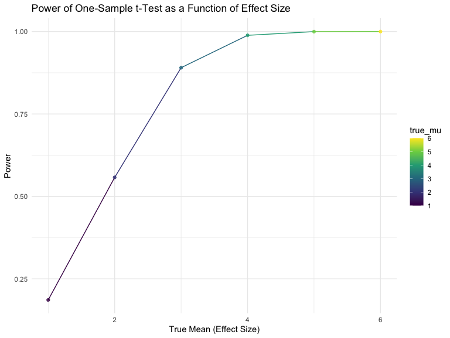
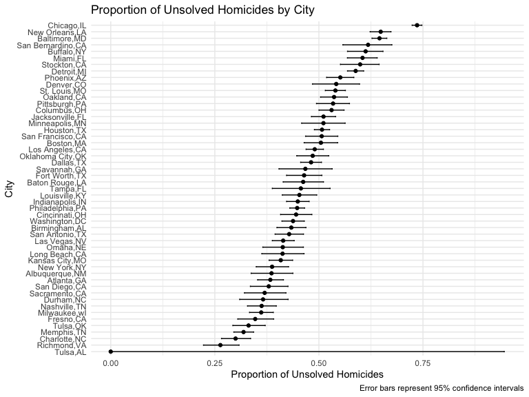

p8105_hw5_rd3096
================
Timothy Du

# load necessary pakages

``` r
library(tidyverse)
```

    ## ── Attaching core tidyverse packages ──────────────────────── tidyverse 2.0.0 ──
    ## ✔ dplyr     1.1.4     ✔ readr     2.1.5
    ## ✔ forcats   1.0.0     ✔ stringr   1.5.1
    ## ✔ ggplot2   3.5.1     ✔ tibble    3.2.1
    ## ✔ lubridate 1.9.3     ✔ tidyr     1.3.1
    ## ✔ purrr     1.0.2     
    ## ── Conflicts ────────────────────────────────────────── tidyverse_conflicts() ──
    ## ✖ dplyr::filter() masks stats::filter()
    ## ✖ dplyr::lag()    masks stats::lag()
    ## ℹ Use the conflicted package (<http://conflicted.r-lib.org/>) to force all conflicts to become errors

``` r
library(rvest)
```

    ## 
    ## Attaching package: 'rvest'
    ## 
    ## The following object is masked from 'package:readr':
    ## 
    ##     guess_encoding

``` r
library(ggplot2)
library(purrr)
library(patchwork)
library(broom)

set.seed(1)


knitr::opts_chunk$set(
    echo = TRUE,
    warning = FALSE,
    fig.width = 8, 
  fig.height = 6,
  out.width = "90%"
)

theme_set(theme_minimal() + theme(legend.position = "bottom"))

options(
  ggplot2.continuous.colour = "viridis",
  ggplot2.continuous.fill = "viridis"
)

scale_colour_discrete = scale_colour_viridis_d
scale_fill_discrete = scale_fill_viridis_d
```

## problem 1

we define a function to simulate birthdays and check for duplicates

``` r
simulate_shared_birthday = function(n) {
  
  birthdays = sample(1:365, n, replace = TRUE)
  
  has_duplicate = any(duplicated(birthdays))
}
```

we run this 10000 timese based on a sample size of 2-50

``` r
compute_duplicate_probability = function(n) {
  
  simulations = map(1:10000, ~simulate_shared_birthday(n)) %>% 
    unlist()
  
  prob = mean(simulations)
  
  # Return result as a tibble
  tibble(
    group_size = n,
    prob_duplicate = prob
  )
}

result_final = map_dfr(2:50, compute_duplicate_probability)

result_final
```

    ## # A tibble: 49 × 2
    ##    group_size prob_duplicate
    ##         <int>          <dbl>
    ##  1          2         0.0024
    ##  2          3         0.0085
    ##  3          4         0.0167
    ##  4          5         0.0267
    ##  5          6         0.0399
    ##  6          7         0.0521
    ##  7          8         0.0751
    ##  8          9         0.0925
    ##  9         10         0.116 
    ## 10         11         0.139 
    ## # ℹ 39 more rows

Make a plot showing the relationship between probability and group size

``` r
ggplot(
  result_final, 
  aes(x = group_size, y = prob_duplicate)
  ) +
  geom_smooth() +
  geom_point(alpha=0.5) +
  labs(
    title = "Probability of Shared Birthday as a Function of Group Size",
    x = "Group Size",
    y = "Probability of Shared Birthday"
  ) +
  theme_minimal()
```

    ## `geom_smooth()` using method = 'loess' and formula = 'y ~ x'


## problem 2

create one-sample t test function and power function

``` r
simulation_test = function(mu, n=30,sigma=5) {
  
  x = rnorm(n=30, mean=mu, sd = sigma)

  one_sample_ttest = t.test (x,mu = 0) %>% 
    broom::tidy()
  
    tibble(
      mu_hat = one_sample_ttest$estimate,
      p_value = one_sample_ttest$p.value
    )
}

power_and_avemu = function(mu, n = 30, sigma = 5) {
 
  simulation_test_results = map_dfr(1:5000, ~ simulation_test(mu, n = 30,sigma = 5))
  
  power = mean(simulation_test_results$p_value < 0.05, na.rm = TRUE)
  
  avg_mu_hat = mean(simulation_test_results$mu_hat, na.rm = TRUE)
  
  rejected_samples = simulation_test_results %>%
  filter(p_value < 0.05)
  
  avg_mu_rejected = mean(rejected_samples$mu_hat, na.rm = TRUE)
  
  # Return a tibble with the true mu and calculated power
  tibble(
    true_mu = mu,
    power = power,
    avg_mu=avg_mu_hat,
    avgmu_reject=avg_mu_rejected
  )
}

mu_values = c(1, 2, 3, 4, 5, 6)

# Calculate power for each value of mu
power_results = map_dfr(mu_values, power_and_avemu)

power_results
```

    ## # A tibble: 6 × 4
    ##   true_mu power avg_mu avgmu_reject
    ##     <dbl> <dbl>  <dbl>        <dbl>
    ## 1       1 0.186   1.00         2.27
    ## 2       2 0.558   1.99         2.62
    ## 3       3 0.890   3.01         3.19
    ## 4       4 0.989   4.01         4.04
    ## 5       5 1.00    5.01         5.01
    ## 6       6 1       6.01         6.01

``` r
ggplot(
  power_results, aes(x = true_mu, y = power,color=true_mu)) +
  geom_line() +
  scale_color_viridis_c()+
  geom_point(alpha=0.8) +
  labs(
    title = "Power of One-Sample t-Test as a Function of Effect Size",
    x = "True Mean (Effect Size)",
    y = "Power"
  ) +
  theme_minimal()
```



Complete the two plots analyzing average estimate of mu_hat and true mu

``` r
estimate_results = map_dfr(mu_values, power_and_avemu)

estimate_results 
```

    ## # A tibble: 6 × 4
    ##   true_mu power avg_mu avgmu_reject
    ##     <dbl> <dbl>  <dbl>        <dbl>
    ## 1       1 0.187   1.00         2.23
    ## 2       2 0.566   2.00         2.61
    ## 3       3 0.886   2.98         3.17
    ## 4       4 0.991   4.00         4.02
    ## 5       5 0.999   5.00         5.00
    ## 6       6 1       6.02         6.02

``` r
mu_plot_1=
  ggplot(estimate_results, aes(x = true_mu, y = avg_mu, color=true_mu)) +
  geom_line() + 
  scale_color_viridis_c()+
  geom_point(size = 2) +     
  labs(
    title = "Average Estimate of μ̂ as a Function of True μ",
    x = "True Mean (μ)",
    y = "Average Estimate of μ̂"
  ) +
  theme_minimal()

mu_plot_2 =
  ggplot(estimate_results, aes(x = true_mu, y = avgmu_reject, color=true_mu)) +
  geom_line() + 
  scale_color_viridis_c()+
  geom_point(size = 2) +     
  labs(
    title = "Average Estimate of μ̂ Only in Rejected Samples",
    x = "True Mean (μ)",
    y = "Average Estimate of μ̂ (Rejected Samples)"
  ) +
  theme_minimal()
  
mu_plot_1+mu_plot_2
```


Right Plot (Rejected Samples Only):

The sample average of mu across tests for which the null hypothesis was
rejected is not approximately equal to the true value of mu.

This plot shows the average mu only for the samples in which the null
hypothesis was rejected (i.e., samples with p-values \< 0.05). In this
case, the average estimate of mu is systematically higher than the true
mu, particularly for lower values of mu, this suggests an upward bias
due to only including samples with significant results.

This discrepancy occurs because we are only considering samples where
the null hypothesis is rejected, which means we are selecting for
samples where mu deviates sufficiently from 0 to yield a significant
result. This introduces selection bias: when filtering for significant
results, the sample means tend to be more extreme (in this case, higher
than the true mu.

## problem3

we first read the homecide-data.csv file and describe this raw datafile

``` r
homicide = read_csv("https://raw.githubusercontent.com/washingtonpost/data-homicides/refs/heads/master/homicide-data.csv")
```

    ## Rows: 52179 Columns: 12
    ## ── Column specification ────────────────────────────────────────────────────────
    ## Delimiter: ","
    ## chr (9): uid, victim_last, victim_first, victim_race, victim_age, victim_sex...
    ## dbl (3): reported_date, lat, lon
    ## 
    ## ℹ Use `spec()` to retrieve the full column specification for this data.
    ## ℹ Specify the column types or set `show_col_types = FALSE` to quiet this message.

``` r
str(homicide)
```

    ## spc_tbl_ [52,179 × 12] (S3: spec_tbl_df/tbl_df/tbl/data.frame)
    ##  $ uid          : chr [1:52179] "Alb-000001" "Alb-000002" "Alb-000003" "Alb-000004" ...
    ##  $ reported_date: num [1:52179] 20100504 20100216 20100601 20100101 20100102 ...
    ##  $ victim_last  : chr [1:52179] "GARCIA" "MONTOYA" "SATTERFIELD" "MENDIOLA" ...
    ##  $ victim_first : chr [1:52179] "JUAN" "CAMERON" "VIVIANA" "CARLOS" ...
    ##  $ victim_race  : chr [1:52179] "Hispanic" "Hispanic" "White" "Hispanic" ...
    ##  $ victim_age   : chr [1:52179] "78" "17" "15" "32" ...
    ##  $ victim_sex   : chr [1:52179] "Male" "Male" "Female" "Male" ...
    ##  $ city         : chr [1:52179] "Albuquerque" "Albuquerque" "Albuquerque" "Albuquerque" ...
    ##  $ state        : chr [1:52179] "NM" "NM" "NM" "NM" ...
    ##  $ lat          : num [1:52179] 35.1 35.1 35.1 35.1 35.1 ...
    ##  $ lon          : num [1:52179] -107 -107 -107 -107 -107 ...
    ##  $ disposition  : chr [1:52179] "Closed without arrest" "Closed by arrest" "Closed without arrest" "Closed by arrest" ...
    ##  - attr(*, "spec")=
    ##   .. cols(
    ##   ..   uid = col_character(),
    ##   ..   reported_date = col_double(),
    ##   ..   victim_last = col_character(),
    ##   ..   victim_first = col_character(),
    ##   ..   victim_race = col_character(),
    ##   ..   victim_age = col_character(),
    ##   ..   victim_sex = col_character(),
    ##   ..   city = col_character(),
    ##   ..   state = col_character(),
    ##   ..   lat = col_double(),
    ##   ..   lon = col_double(),
    ##   ..   disposition = col_character()
    ##   .. )
    ##  - attr(*, "problems")=<externalptr>

The raw data consists of 52,179 rows and 12 columns. Each row represents
a unique homicide case, this dataset provides detailed information about
each homicide case, including geographic data, victim demographics, and
case dispositions. Some typical columns include unid, reported_date,
victim_last and vitcim_first name. The more detailed information about
these columns are listed as follow: uid: A unique identifier for each
case (character). reported_date: The date the homicide was reported, in
YYYYMMDD format (numeric). victim_last: The last name of the victim
(character). victim_first: The first name of the victim (character).
victim_race: The race of the victim (character). victim_age: The age of
the victim (character; possibly contains missing or non-numeric values).
victim_sex: The sex of the victim (character, likely “Male” or
“Female”). city: The city where the homicide occurred (character).
state: The state abbreviation for where the homicide occurred
(character). lat: The latitude of the homicide location (numeric). lon:
The longitude of the homicide location (numeric). disposition: The
outcome or current status of the case, e.g., “Closed without arrest,”
“Closed by arrest,” “Open/No arrest” (character).

Next step we will create a new variable and summarize within cities to
get our desired total number of homicides and the number of unsolved
homicides.

``` r
homicide_summary = 
  homicide %>% 
  mutate(
    city_state = str_c(city, ",", state)
  ) %>% 
  group_by(city_state) %>% 
  summarize(
    total_homides = n(),
    total_unsolved= sum(disposition %in% c("Closed without arrest","Open/No arrest"))
  )

homicide_summary
```

    ## # A tibble: 51 × 3
    ##    city_state     total_homides total_unsolved
    ##    <chr>                  <int>          <int>
    ##  1 Albuquerque,NM           378            146
    ##  2 Atlanta,GA               973            373
    ##  3 Baltimore,MD            2827           1825
    ##  4 Baton Rouge,LA           424            196
    ##  5 Birmingham,AL            800            347
    ##  6 Boston,MA                614            310
    ##  7 Buffalo,NY               521            319
    ##  8 Charlotte,NC             687            206
    ##  9 Chicago,IL              5535           4073
    ## 10 Cincinnati,OH            694            309
    ## # ℹ 41 more rows

we will perform the prop.test on the city of Baltimore, MD

``` r
baltimore_data = 
  homicide_summary %>% 
  filter(city_state == "Baltimore,MD")

baltimore_prop_test_result =
  prop.test(
    x = baltimore_data$total_unsolved,
    n = baltimore_data$total_homides
  )

baltimore_prop_test_result 
```

    ## 
    ##  1-sample proportions test with continuity correction
    ## 
    ## data:  baltimore_data$total_unsolved out of baltimore_data$total_homides, null probability 0.5
    ## X-squared = 239.01, df = 1, p-value < 2.2e-16
    ## alternative hypothesis: true p is not equal to 0.5
    ## 95 percent confidence interval:
    ##  0.6275625 0.6631599
    ## sample estimates:
    ##         p 
    ## 0.6455607

``` r
baltimore_summary = 
  baltimore_prop_test_result %>% 
  broom::tidy() %>% 
  select(estimate, conf.low, conf.high)
```

we will run prop.test for each of the cities in our dataset

``` r
homicide_prop_analysis = 
  homicide_summary %>% 
  mutate(
    prop_test_result = map2(
      total_unsolved,
      total_homides,
      ~ prop.test (x=.x,n=.y)),
    tidy_result = map (prop_test_result, broom::tidy)
    ) %>% 
  select(city_state, tidy_result) %>% 
  unnest() %>% 
  select(city_state, estimate,conf.low, conf.high)
  
homicide_prop_analysis
```

    ## # A tibble: 51 × 4
    ##    city_state     estimate conf.low conf.high
    ##    <chr>             <dbl>    <dbl>     <dbl>
    ##  1 Albuquerque,NM    0.386    0.337     0.438
    ##  2 Atlanta,GA        0.383    0.353     0.415
    ##  3 Baltimore,MD      0.646    0.628     0.663
    ##  4 Baton Rouge,LA    0.462    0.414     0.511
    ##  5 Birmingham,AL     0.434    0.399     0.469
    ##  6 Boston,MA         0.505    0.465     0.545
    ##  7 Buffalo,NY        0.612    0.569     0.654
    ##  8 Charlotte,NC      0.300    0.266     0.336
    ##  9 Chicago,IL        0.736    0.724     0.747
    ## 10 Cincinnati,OH     0.445    0.408     0.483
    ## # ℹ 41 more rows

Create a plot that shows the estimated and CIs for each city

``` r
homicide_order = 
  homicide_prop_analysis %>%
  mutate(
    city_state = reorder(city_state, estimate)
    )

homicide_plot =
  homicide_order %>% 
  ggplot(aes(x = city_state, y = estimate)) +
  geom_point() +
  geom_errorbar(aes(ymin = conf.low, ymax = conf.high), width = 0.2) +
  coord_flip() +
  labs(
    title = "Proportion of Unsolved Homicides by City",
    x = "City",
    y = "Proportion of Unsolved Homicides",
    caption = "Error bars represent 95% confidence intervals"
  ) +
  theme_minimal()

homicide_plot
```


